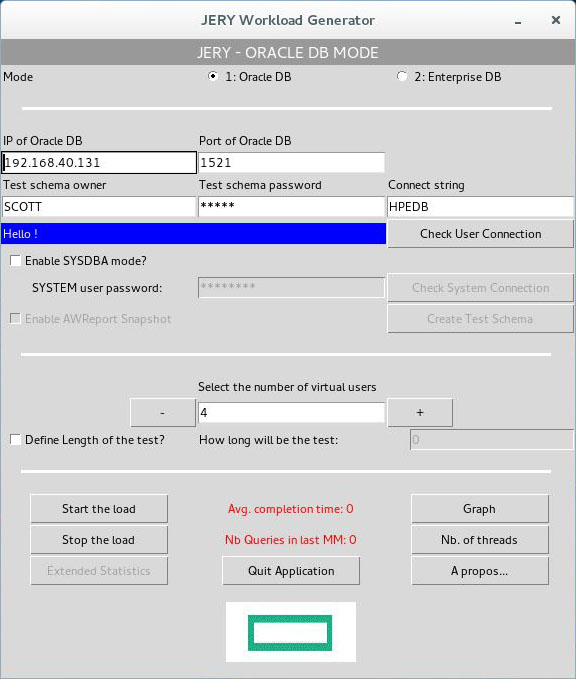

#JERY
JERY is a Python 2.7 based simple database workload generator for Oracle and Enterprise Databases. It is designed to run in a special Docker image and it is streaming it's GUI through x11 to your host OS. 



##Info
To download install instructions use the readme.pdf [_(download)_](https://github.hpe.com/marcel-jakob/jery/raw/master/readme.pdf)

##Table of Contents
- [Requirements](#Requirements)
- [Installation](#Installation) 
- [What is Jery?](#WhatisJery)
- [Used Libraries](#UsedLibraries)
- [Adding an insecure Docker registry](#AddinganinsecureDockerregistry)

<a name="Requirements"/>
##Requirements
JERY is meant to run on Linux Systems only (primarily RHEL and CentOS). For this reason the following installation guide is mainly for RHEL. Since JERY is running in a Docker image, a recent version of Docker needs to be installed on the system.

1) Log into your machine as a user with sudo or root privileges   
2) Make sure your existing yum packages are up-to-date  
```shell
$ sudo yum update
```
3) Add the yum repo yourself  
```shell
$ sudo tee /etc/yum.repos.d/docker.repo <<-EOF
[dockerrepo]
name=Docker Repository
baseurl=https://yum.dockerproject.org/repo/main/centos/7
enabled=1
gpgcheck=1
gpgkey=https://yum.dockerproject.org/gpg
EOF
```
4) Install the Docker package
 ```shell
$ sudo yum install docker-engine
```
5) Start the Docker daemon
```shell
$ sudo service docker start
```
6) Verify docker is installed correctly by running a test image in a container
```shell
$ sudo docker run hello-world
Unable to find image 'hello-world:latest' locally
 latest: Pulling from hello-world
 a8219747be10: Pull complete
    91c95931e552: Already exists
    hello-world:latest: The image you are pulling has been verified. Important: image verification is a tech preview feature and should not be relied on to provide security.
    Digest: sha256:aa03e5d0d5553b4c3473e89c8619cf79df368babd1.7.1cf5daeb82aab55838d
    Status: Downloaded newer image for hello-world:latest
    Hello from Docker.
    This message shows that your installation appears to be working correctly.

    To generate this message, Docker took the following steps:
     1. The Docker client contacted the Docker daemon.
     2. The Docker daemon pulled the "hello-world" image from the Docker Hub.
        (Assuming it was not already locally available.)
     3. The Docker daemon created a new container from that image which runs the
        executable that produces the output you are currently reading.
     4. The Docker daemon streamed that output to the Docker client, which sent it
        to your terminal.

    To try something more ambitious, you can run an Ubuntu container with:
     $ docker run -it ubuntu bash

    For more examples and ideas, visit:
     http://docs.docker.com/userguide/
```
> \* copied from http://docs.master.dockerproject.org/engine/installation/linux/rhel/

Docker install guides for other linux distributions can be found under:
- [Installation on Ubuntu](http://docs.master.dockerproject.org/engine/installation/linux/ubuntulinux/)
- [Installation on CentOS](http://docs.master.dockerproject.org/engine/installation/linux/centos/)
- [Installation on Oracle Linux](http://docs.master.dockerproject.org/engine/installation/linux/oracle/)

<a name="Installation"/>
##Installation
JERY can either be downloaded from this GitHub page or from a Docker registry. These possibilities are described in the following.

__1) Download latest build from GitHub page and import image__
- download the latest release from this GitHub page [_(download)_](https://github.hpe.com/marcel-jakob/jery/releases)
- unzip the build file
- open a new terminal and navigate to the unzipped file _(jerydocker.tar)_
- import the unzipped file with 

```shell
docker load < jerydocker.tar
```
- download the run script and execute it [_(right click here + "save link as")_](https://raw.github.hpe.com/marcel-jakob/jery/master/run.sh)

__2) Download and import latest build from a the Docker registry__


_From within the HPE network_

1) Open a new terminal and type 

```shell
 sudo su
```
2) Login to HPE Docker Hub with your Windows NT credentials:

```shell
 docker login hub.docker.hpecorp.net
 ```
3) Pull the jerydocker image with the command:

```shell
 docker pull hub.docker.hpecorp.net/oraclekc/jery:latest
```

4) Rename the pulled image to jerydocker

```shell
 docker tag hub.docker.hpecorp.net/oraclekc/jery jerydocker
```
5) Download the run script and execute it [_(download)_](https://raw.github.hpe.com/marcel-jakob/jery/master/run.sh)

_From within the EPC network_

1) Open a new terminal and type 

```shell
sudo su
```
2) Add dockerregistry.oracle.epc.ext.hpe.com:5000 as an insecure registry [_(how to)_](https://github.hpe.com/marcel-jakob/jery/blob/master/docker/README.md#adding-an-insecure-docker-registry) 
3) Execute the command:

```shell
docker pull dockerregistry.oracle.epc.ext.hpe.com:5000/jerydocker
```
4) Rename the pulled image to jerydocker

```shell
 docker tag dockerregistry.oracle.epc.ext.hpe.com:5000/jerydocker jerydocker
```
4) Download the run script and execute it [_(download)_](https://raw.github.hpe.com/marcel-jakob/jery/blob/master/run.sh)

<a name="WhatisJery"/>
##What is Jery?

- Dedicated to Oracle and Enterprise DB
- Mimic Business Intelligence workload (100% massive read)
- Cluster aware
- Create its own test schema based of "SCOTT" data
- Generate CPU intensive activity
- Generate high IO rate (tunable)
- Can be user in user mode or in sysdba mode
- Provide:
    - execution time for critical query
    - Number of transaction per minute
    - Total number of transaction per run
    - System statistics
- Snapshot for AWR report
- Ideal for:
    - System demonstration
    - Calibration
    - Performance comparison

_However, JERY is not a benchmark tool_

<a name="UsedLibraries"/>
##Used Libraries

- [Tkinter](http://tkinter.unpythonic.net/wiki/)
- [cx_Oracle](https://cx-oracle.readthedocs.io/en/latest/)
- [threading](https://docs.python.org/2/library/threading.html)
- [ConfigParser](https://docs.python.org/2/library/configparser.html)
- [psycopg2](http://initd.org/psycopg/)


<a name="AddinganinsecureDockerregistry"/>
##Adding an insecure Docker registry
There are two options for adding a registry with no authorization to Docker running on RHEL7 (on client which wants to push/pull to registry)
####Start Docker daemon with --insecure-registry
```$ dockerd --insecure-registry= dockerregistry.oracle.epc.ext.hpe.com:5000```
####Edit config of service to add --insecure-registry <br>
Refer to https://docs.docker.com/engine/admin/ (CentOS / Red Hat Enterprise Linux / Fedora > Configuring Docker) <br>

1) Create the Docker config file

```$ sudo mkdir /etc/systemd/system/docker.service.d``` <br>
```$ sudo nano /etc/systemd/system/docker.service.d/docker.conf``` <br><br>
2) Add the following to the created docker.conf: <br>

```
[Service]
ExecStart=
ExecStart=/usr/bin/dockerd -–insecure-registry=dockerregistry.oracle.epc.ext.hpe.com:5000
```
3) reload + restart the Docker daemon

```$ sudo systemctl daemon-reload```<br>
```$ sudo systemctl restart docker```<br><br>
4) Check if “dockerregistry.oracle.epc.ext.hpe.com:5000” is added to point “Insecure Registries” of docker info:<br>

```$ docker info```
